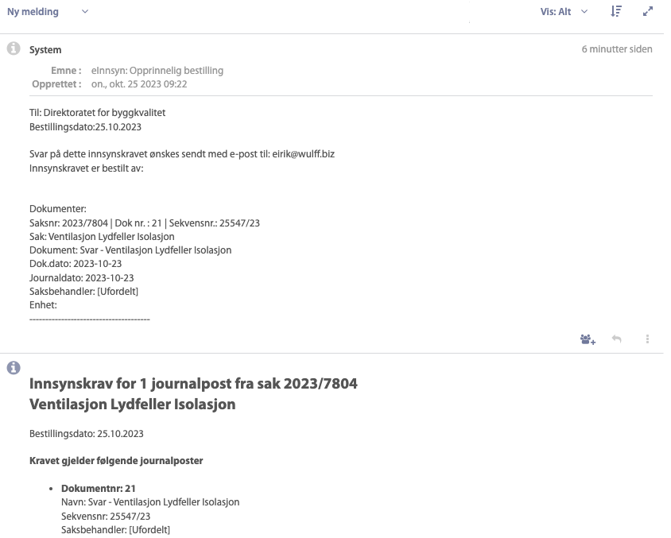

# Funksjonalitet mot eFormidling #

Ideelt sett burde vi kunne bruke Pureservice til å sende og motta meldinger gjennom eFormidling. Dessverre er støtten for eFormidling veldig bundet til tradisjonell sak/arkiv, men det er mulig å komme rundt.

For å kunne bruke eFormidling har vi valgt å etablere et integrasjonspunkt som en Azure App Service. Dette er i praksis en docker-konteiner som kjører bak en webtjener. Vi har også satt denne opp med IP whitelisting og basic auth for å gjøre den litt sikrere i bruk.

Hovedfunksjonen til integrasjonspunktet er å kryptere og dekryptere forsendelsene, samt slå opp hvordan utgående meldinger skal sendes.

## Integrasjonspunktet til DiBK er aktivert for ##

* DPO - Altinn digital postkasse for offentlige (statlige) virksomheter
* DPV - Digital postkasse for virksomheter
* DPE - eInnsyn (publisering og innsynskrav)
* DPF - SvarUt sending og mottakstjeneste

Det er en stor fordel at man aktiverer så mange som mulig av kanalene i integrasjonspunktet, slik at man slipper å ha flere forskjellige løsninger for innkommende forsendelser. eFormidling-integrasjonen erstatter f.eks. både svarinn2pureservice-funksjonen og innsynskrav-funksjonen til sync2pureservice.

Integrasjonspunktet vil automatisk ta imot innkommende meldinger fra de aktiverte tjenestene og lagre dem i sin database (vi anbefaler å sette opp en database utenfor selve integrasjonspunktet for økt sikkerhet), slik at de er klare for henting gjennom [eFormidling 2-APIet](https://docs.digdir.no/docs/eFormidling/Utvikling/integrasjonspunkt_eformidling2_api). Utgående meldinger tas imot med samme API, og pakkes og sendes videre til eFormidling sin backend for videre levering.

## Innkommende meldinger ##

Funksjonaliteten rundt innkommende eFormidling-meldinger er basert på én tjeneste i sync2pureservice: **eformidling:inn**. Denne tjenesten logger seg på integrasjonspunktet og ser etter nye meldinger. Den kjøres fra kommandolinjen slik:
`php artisan eformidling:inn`

En melding i eFormidling er i all hovedsak basert på metadata i JSON- og XML-format, samt vedlegg. Vedleggene er det reelle innholdet i forsendelsen, resten er 'konvolutten'.

Når en forsendelse blir funnet på integrasjonspunktet vil sync2pureservice laste ned og pakke ut vedleggene og bruke metadataene til å opprette avsenders virksomhet og en egen eFormidling-avsender i Pureservice. Deretter oppretter sync2pureservice en sak der metadataene brukes til å lage en beskrivelse, og laster opp vedleggene til saken. Saken fordeles til valgt sone og team, og er klar for behandling i Pureservice.

For at vedleggene skal bli korrekt arkiverte i Documaster når saken lukkes (en egen app i Pureservice) vil sync2pureservice opprette en egen innkommende melding for vedleggene til saken. Det kan se litt forvirrende ut, men resultatet er at vedleggene kommer inn i saken, og når saken arkiveres vil de bli arkiverte som vedlegg til journalpost nr 2 på saken.

Dersom den innkommende meldingen er et innsynkrav vil sync2pureservice bruke metadata fra innsynkravet til å hente ut hvilke saker og dokumenter kravet gjelder. Deretter oppretter sync2pureservice én sak i Pureservice per saksnummer det ønskes innsyn i. Det er ofte forskjellige saksbehandlere på ulike saker, og ved å splitte innsynskravet blir det raskere å besvare det.

De enkelte innsynskravene vil også inneholde en skjult kommunikasjon (som vises ved å vise 'Alt' i Pureservice) som inneholder teksten fra det opprinnelige innsynskravet.

## Utgående meldinger ##

Også utgående meldinger kan nå sendes via eFormidling. Dette er litt tricky, all den tid Pureservice alltid vil forsøke å svare på e-post. Løsningen ligger i å overvåke ikke leverte e-poster og sende dem ut via eFormidling dersom de er adresserte til en eFormidling-adresse (xxx@eformidling.pureservice.local). Dette er inkludert som en del av [Pureservice Utsending](utsendelse.md).

# Oppsett for kjøring #

Det er en rekke miljøvariabler som må settes for at eFormidling skal fungere i sync2pureservice. Noen av disse har fallbacks, og vil falle tilbake til andre miljøvariabler eller standardverdier dersom de ikke er satt.

## Integrasjonspunktet ##

| Variabel | Standardverdi | Kommentar |
|----|----|----|
| EF_IP_URL | | URL til integrasjonspunktet, f.eks. 'https://integrasjonspunkt.local:9093' |
| EF_IP_AUTH | false | Angir om integrasjonspunktet krever innlogging. ANBEFALES STERKT |
| EF_IP_USER | | Brukernavnet, hvis innlogging kreves |
| EF_IP_PASSWORD | | Passordet, hvis innlogging kreves |

Vi kan forøvrig anbefale å sette opp integrasjonspunktet i nettskyen, og har laget et docker-oppsett som fungerer veldig bra som en web app i Microsoft Azure. Der har vi også sperret ned tilgangen basert på IP-adresser (IP-whitelisting), samt slått på innlogging. [Mer om dette her](https://bitbucket.org/dibk/docker-integrasjonspunkt/).

## Innsynkrav (DPE) ##

| Variabel | Standardverdi | Kommentar |
|----|----|----|
| DPE_TICKET_TYPE | Innsynskrav | Sakstypen som skal brukes for innsynskrav. **Må defineres i Pureservice**. Det er også lurt å legge et tjenestenivå på denne sakstypen, siden det er lovpålagt å besvare innsynskravet innen tre arbeidsdager. |
| DPE_TICKET_TEAM | verdien fra PURESERVICE_TICKET_TEAM | Navn på Pureservice-teamet som skal få innsynskrav. **Må defineres i Pureservice** |
| DPE_TICKET_ZONE | verdien fra PURESERVICE_TICKET_ZONE | Navn på samhandlingssonen i Pureservice som skal få innsynskrav. **Må defineres i Pureservice** |
| DPE_TICKET_SOURCE | Innsynskrav | Navn på kilden som skal brukes for innsynskrav. **Må defineres i Pureservice** |
| DPE_TICKET_PRIORITY | Høy | Prioritet for innsynkravet. Det er lurt å kombinere dette med tjenestenivå på sakstypen Innsynskrav |
| DPE_TICKET_VISIBILITY | 1 | Synlighet for sakens sluttbruker. 0 = synlig, 1 = synlig uten kvittering, 2 = ikke synlig |

## eFormidling (EF = DPF + DPO + DPV) ##

| Variabel | Standardverdi | Kommentar |
|----|----|----|
| EF_SELF_ID |  | Din virksomhet sitt organisasjonsnr, angitt som 1234567879. Dette brukes for å sette avsender på utgående meldinger |
| EF_SYSTEM_ID | vilkårlig UUID | ID som sync2pureservice skal bruke som SystemID på utgående meldinger. Det anbefales å bruke en UUID som verdi, f.eks. '720808bd-d3a7-40bc-a13d-8f0020c15cc3' |
| EF_TICKET_ZONE | verdien fra PURESERVICE_TICKET_ZONE | Navn på samhandlingssone som skal motta eFormidling-meldinger. **Må defineres i Pureservice** |
| EF_TICKET_TEAM | verdien fra PURESERVICE_TICKET_TEAM | Navn på teamet som skal motta eFormidling-meldinger. **Må defineres i Pureservice** |
| EF_TICKET_SOURCE | eFormidling | Navnet på kilden som skal brukes for eFormidling-meldinger. **Må defineres i Pureservice** |
| EF_TICKET_TYPE | verdien fra PURESERVICE_TICKET_TYPE | Sakstypen som skal brukes for eFormidling-meldinger |
| EF_TICKET_VISIBILITY | 2 | Synlighet for sakens sluttbruker. 0 = synlig, 1 = synlig uten kvittering, 2 = ikke synlig. Det gir mest mening å la denne stå som stå med standardverdi, siden det ikke gir mening å sende autosvar via eFormidling (der mottak kvitteres automatisk) |

