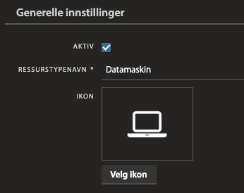
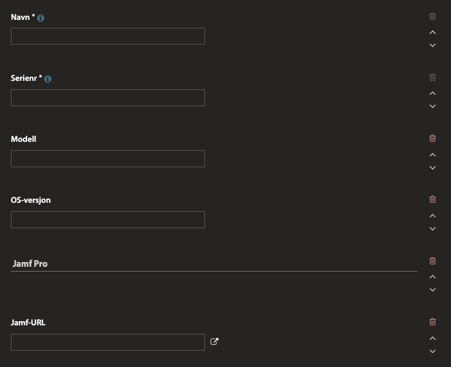
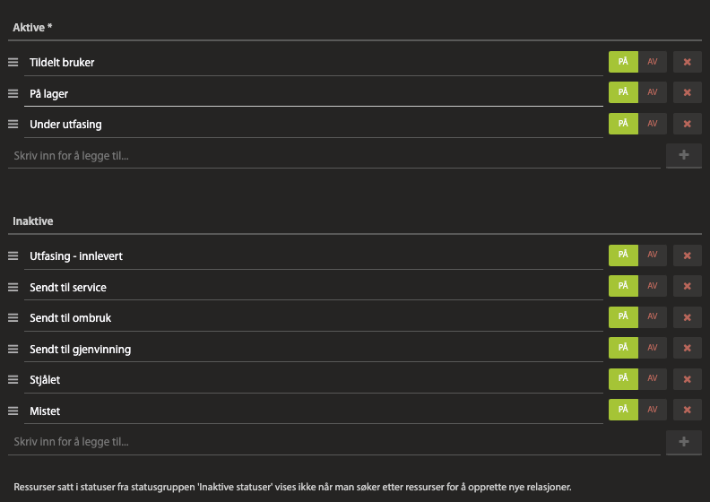

# Hva gjør jamf2pureservice?

Jamf2pureservice er en konsoll-kommando som utfører følgende operasjoner:

1. Kobler til Jamf Pro
2. Kobler til Pureservice og setter opp koblinger mot ressurstyper og statuser basert på ressurstypenes navn
3. Laster inn alle enheter fra Jamf Pro og Pureservice
4. Går gjennom enhetene fra Jamf Pro, og regner ut EOL og bestemmer status på enheter som skal fases ut
5. Oppdaterer/oppretter enhetene i Pureservice
6. Kobler enheter i Pureservice mot brukere, slik det er registrert i Jamf Pro
7. Går gjennom enheter i Pureservice som ikke er registrerte i Jamf Pro, og oppdaterer status på dem. Gamle enheter slettes fra Pureservice.

## Systemkrav

- En instans av Jamf Pro
- En Pureservice-instans med brukersynkronisering (f.eks. Azure AD) som er ajour med brukerne i Jamf Pro
- Pureservice Assets satt opp med to ressurstyper: Datamaskin og mobilenhet
- PHP 8.x og PHP composer på maskinen eller konteineren som skal kjøre synkroniseringen

## Nødvendige miljøvariabler

Det er en rekke miljøvariabler som er nødvendige for at skriptet skal få gjort alt som trengs. Mye av dette krever oppsett i Pureservice. Variablene kan settes i .env-fila, eller de kan settes opp som miljøvariabler før kjøring. Sistnevnte er å foretrekke om man bruker Pipelines el.l. for å kjøre synkroniseringen.

| Variabel | Standardverdi | Beskrivelse |
| ----------- | ----------- | ----------- |
| JAMFPRO_URL | https://customer.jamfcloud.com | Angir base-adressen til Jamf Pro-instansen. Det er ikke nødvendig å bruke /api el.l. |
| JAMFPRO_CLIENTID / JAMFPRO_USER | | Client ID når man vil logge inn gjennom [API-klient](https://learn.jamf.com/en-US/bundle/jamf-pro-documentation-current/page/API_Roles_and_Clients.html) (anbefales). Eller du kan bruke en bruker med lesetilgang, og oppgi brukernavnet som JAMPRO_USER |
| JAMFPRO_SECRET / JAMFPRO_PASSWORD | | Client Secret når man bruker API-klient eller passord for admin-bruker |
| PURESERVICE_URL | https://customer.pureservice.com | Base-adressen til Pureservice-instansen |
| PURESERVICE_APIKEY | ey... | API-nøkkel (egentlig token) til Pureservice |

Dersom du bruker [API-klient](https://learn.jamf.com/en-US/bundle/jamf-pro-documentation-current/page/API_Roles_and_Clients.html) for å logge inn må du i Jamf Pro sette opp en API-klient med en rolle som gir tilgangene "Read Computers" og "Read Mobile Devices". Dette er absolutt å foretrekke i stedet for å sette opp en administrator-bruker.

## Nødvendig oppsett i Pureservice

Før synkronisering kan kjøres må du opprette de to ressurstypene for å lagre datamaskiner og mobilenheter i Pureservice. Du kan kalle ressurstypene hva du vil, og oppgi ressurstypenes navn som miljøvariabler.

| Miljøvariabel | Standardverdi | Beskrivelse |
| ----------- | ----------- | ----------- |
| PURESERVICE_COMPUTER_ASSETTYPE_NAME | Datamaskin | Navnet til ressurstypen som brukes til datamaskiner i Pureservice |
| PURESERVICE_MOBILE_ASSETTYPE_NAME | Mobilenhet | Navnet til ressurstypen som brukes til mobilenheter i Pureservice |

### Felter for ressurstypene

Feltene er stort sett felles for de to ressurstypene, men feltnavnene kan også overstyres med miljøvariabler. Har lagt opp til at man kan ha forskjellige feltnavn for datamaskiner og mobilenheter, og når man oppgir miljøvariabler må [TYPE] i tabellen under erstattes med enten "COMPUTER" eller "MOBILE". Feltene som må settes som Påkrevde i Pureservice er i grunnen bare Navn og Serienr.

| Miljøvariabel | Standardverdi | Type | Beskrivelse |
| ----------- | ----------- | ----------- | ----------- |
| PURESERVICE_[TYPE]_FIELD_NAME | Navn | Navnefelt | Feltet som brukes som enhetens navn (påkrevd) |
| PURESERVICE_[TYPE]_FIELD_SERIAL | Serienr | Unik verdi | Enhetens serienummer (unikt og påkrevd) |
| PURESERVICE_[TYPE]_FIELD_MODEL | Modell | Tekst | Enhetens modellnavn fra Jamf Pro |
| PURESERVICE_[TYPE]_FIELD_MODELID | ModelID | Tekst | Enhetens modell-ID, f.eks. 'MacMini11,1' |
| PURESERVICE_[TYPE]_FIELD_OS | OS-versjon | Tekst | Enhetens OS-versjon |
| PURESERVICE_COMPUTER_FIELD_PROCESSOR | Prosessor | Tekst | Enhetens prosessortype - brukes ikke av mobilenheter |
| PURESERVICE_[TYPE]_FIELD_JAMFURL | Jamf-URL | Tekst med knapphandling URL: %@ | Lenke til enheten i Jamf Pro |
| PURESERVICE_[TYPE]_FIELD_LASTSEEN | Sist sett | Dato | Tidsangivelse for når enheten ble sist sett av Jamf Pro |
| PURESERVICE_[TYPE]_FIELD_MEMBERSINCE | Innmeldt | Dato | Tidsangivelse for når enheten første gang ble innrullert i Jamf Pro |
| PURESERVICE_[TYPE]_FIELD_EOL | EOL | Dato | Dato for når enheten forventes å skiftes ut. Regnes ut av jamf2pureservice |
| Ikke i bruk | Kommentarer | Tekst | Tekstfelt for å skrive inn kommentarer for selve enheten. Brukes ikke av jamf2pureservice |

Vi har lagt opp til at jamf2pureservice henter inn riktige property-navn fra Pureseservice, basert på feltnavnene som oppgis i miljøvariablene. På den måten kan man fritt bruke spesialtegn i feltnavnene.

### Statuser for ressurstypene

Vi har lagt opp til at systemet bruker en rekke statuser for å angi hvor i livsløpet en enhet befinner seg. Statusnavnene settes opp som miljøvariabler, og jamf2pureservice vil finne de IDer til de oppgitte statusene og lenke dem opp til enhetene.

Følgende statuser er forventet inne i Pureservice, der de tre første regnes som aktive statuser, mens de øvrige er inaktive. [TYPE] skal være enten COMPUTER eller MOBILE, som tidligere nevnt.

| Miljøvariabel | Standardverdi | Type status | Beskrivelse |
| ----------- | ----------- | ----------- | ----------- |
| PURESERVICE_[TYPE]_STATUS_DEPLOYED | Tildelt bruker | Aktiv | Vanlig status for enhet som er utlevert til bruker |
| PURESERVICE_[TYPE]_STATUS_IN_STORAGE | På lager | Aktiv | Status for en utleverbar enhet som står på lager |
| PURESERVICE_[TYPE]_STATUS_PHASEOUT | Under utfasing | Aktiv | Enheten nærmer seg eller har passert EOL, men er fremdeles utlevert |
| PURESERVICE_[TYPE]_STATUS_REUSED | Sendt til ombruk | Inaktiv | Enheten er ikke lenger i bruk, og har blitt overlevert til ombruk |
| PURESERVICE_[TYPE]_STATUS_RECYCLED | Sendt til gjenvinning | Inaktiv | Enheten er ikke i bruk, og har blitt sendt til gjenbruk |
| PURESERVICE_[TYPE]_STATUS_STOLEN | Stjålet | Inaktiv | Enheten er meldt stjålet |
| PURESERVICE_[TYPE]_STATUS_LOST | Mistet | Inaktiv | Enheten har kommet bort |
| PURESERVICE_[TYPE]_STATUS_SERVICE | Sendt til service | Inaktiv | Enheten har blitt sendt til reparasjon |
| PURESERVICE_[TYPE]_STATUS_PHASEDOUT | Utfasing - innlevert | Inaktiv | Enheten er levert inn av bruker, klar for ombruk eller gjenvinning |

### Relasjoner

Vi har lagt opp til at jamf2pureservice kun vedlikeholder en relasjon mellom ressurs og tildelt bruker. Øvrige relasjoner blir ikke brukt i synkroniseringen. 

Det er best om man lager en test-enhet for hver ressurs før man kjører jamf2pureservice første gang. Test-ressursene kan gjerne ha serienummer som eksisterer i Jamf Pro, og de må lenkes mot en bruker i Pureservice (gjennom relasjoner). Da vil jamf2pureservice få tak i korrekt relasjonsoppsett når det kjører første gang, og hvis test-ressursene har serienummer som finnes i Jamf Pro vil de uansett bli overskrevne med reelle data når skriptet kjøres.

## Installasjon
1. Last ned eller klon jamf2pureservice
2. Kjør `composer install` for å installere biblioteker og rammeverk
3. Kopier fila .env.example til .env (`cp .env.example .env`), og fyll ut nødvendige miljøvariabler for koblinger mot Jamf Pro og Pureservice.
4. Kjør `./artisan key:generate` for å opprette en unik APP_KEY i .env
5. Synkroniseringen kjøres med `./artisan pureservice:sync-jamf`

Fila bitbucket-pipelines.yml gir et eksempel på hvordan dette kan kjøres gjennom Pipelines. I slike tilfeller kan innholdet i .env være erstattet med miljøvariabler som settes i Pipeline-oppsettet.

## Andre miljøvariabler

| Miljøvariabel | Standardverdi | Beskrivelse |
| ----------- | ----------- | ----------- |
| PURESERVICE_COMPUTER_LIFESPAN | 4 | Forventet levetid for datamaskiner, oppgitt i antall år |
| PURESERVICE_MOBILE_LIFESPAN | 3 | Forventet levetid for mobilenheter, oppgitt i antall år |
