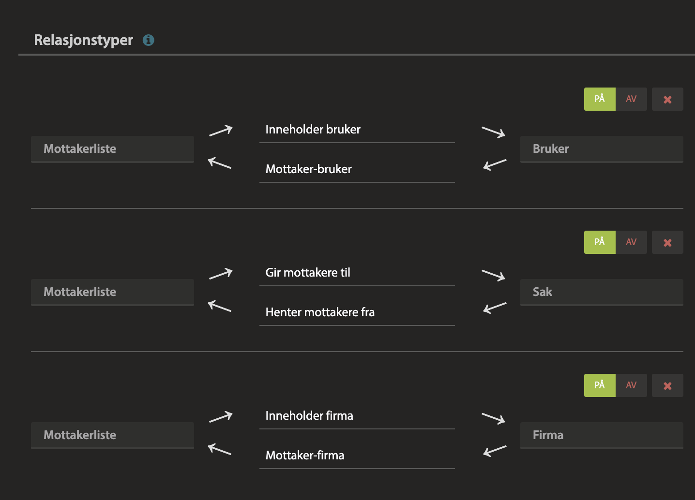

# Synking av mottakerlister #

For at masseutsendelse skal fungere må man nødvendigvis bruke en eller annen form for adresselister. Med Pureservice har vi derfor opprettet mottakerlister som en ressurs:

- Ressursen har et unikt navn
- Ressursen har en listeansvarlig (saksbehandler), som kan kontaktes ved behov
- Mottakerne til ressursen er relaterte til ressursen, enten som firma eller sluttbrukere

Siden vi allerede har et oppsett for å hente inn kommuner, fylkeskommuner og statlige virksomheter gjennom sync2pureservice lager vi tre mottakerlister med samme unikt navn som foretakskoden i BRREG, henholdsvis KOMM, FYLK og STAT.

Ved å kjøre skriptet `./sync2pureservice pureservice:mailing-lists` vil de tre mottakerlistene automatisk bli koblet til de tre kategoriene, dvs at alle kommuner blir koblet til mottakerlisten med unikt navn 'KOMM' osv.

## MILJØVARIABLER ##

Som vanlig er det noen miljøvariabler som må være der for at skriptet skal finne frem til riktig oppsett i Pureservice.

| Variabel | Standardverdi | Beskrivelse |
| ----------- | ----------- | ----------- |
| **PURESERVICE_URL** | https://customer.pureservice.com | Base-adressen til Pureservice-instansen |
| **PURESERVICE_APIKEY** | ey... | API-nøkkel til Pureservice |
| PURESERVICE_DISPATCH_LIST_ASSETNAME | Mottakerliste | Navnet til ressurstypen i Pureservice |
| PURESERVICE_DISPATCH_LINK_TO_COMPANY | Inneholder firma | Navnet som brukes i relasjonen fra ressursen mot firma |
| PURESERVICE_DISPATCH_LINK_TO_USER | Inneholder bruker | Navnet som brukes i relasjonen fra ressursen mot bruker |
| PURESERVICE_DISPATCH_LINK_TO_TICKET | Gir mottakere til | Navnet som brukes i relasjonen fra ressursen mot sak |

Relasjoner i Pureservice er litt komplisert, spesielt siden APIet ikke gir noe særlig god oversikt over dem. Man kan relatere ett objekt til et annet, men bruker man ikke riktig relasjonstype vil ikke relasjonen dukke opp riktig i brukergrensesnittet til Pureservice. Derfor setter vi egne navn på relasjonstypene.

Merk at det øverste navnet for hver relasjon er det som må stemme med miljøvariablene ovenfor.

Med mottakerlister på plass og befolket kan man nå bruke [utsendelse-funksjonene](utsendelse.md) til å sende ut masseutsendelser.
